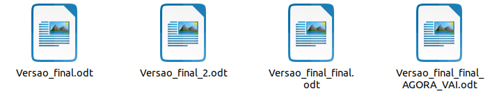

# 🤖 MecatroniGit

- [🤖 MecatroniGit](#-mecatronigit)
  - [📚 O que é](#-o-que-é)
  - [🔖 Sobre](#-sobre)
  - [🏗️ Organização](#️-organização)
  - [↪️ Git e GitHub](#️-git-e-github)
  - [✨ Contribuindo](#-contribuindo)
  - [🗺️ Páginas úteis](#️-páginas-úteis)
  - [🔗 Links bacanas](#-links-bacanas)

## 📚 O que é

Organização de conteúdo feita por alunas e alunos do curso de Engenharia Mecatrônica da Poli - USP sobre tópicos de computação no contexto da mecatrônica.

- [Lista de disciplinas](https://github.com/MecatroniGit)
- [Homepage](https://mecatronigit.github.io/)

## 🔖 Sobre

Um cenário recorrente nas aulas do curso de mecatrônica é um conjunto de alunas e alunos com familiaridade ou conhecimento prévio extremamente diverso. É fácil encontrar desde uma pessoa que já manja muito do assunto até alguém que está tendo na aula o seu primeiro contato com o tema. A mecatrônica é por excelência um curso que mistura várias áreas consideravelmente diferentes, então quem manja de computação pode ser a pessoa que vai boiar na aula de processos de fabricação e vice versa.

Aqui, nós reunimos conteúdo sobre todas as disciplinas do curso que flertam com a computação, com códigos antigos, dicas e links úteis que nos ajudaram e podem ajudar gerações futuras.

## 🏗️ Organização

Cada disciplina possui o seu repositório veja [aqui](https://github.com/MecatroniGit) a lista completa. Dentro do repositório, estão divididas de acordo com o ano e dentro do ano o tipo de atividade (laboratório, EPs e etc).

Por exemplo

    PMR3106 - Intro a Arduino
    - 2017/
        - Lab1/
            - FelipeGomes/
            - DiegoJun/
        - Lab2/
            - RafaelSobral/
            - MisaSwan/
    - Resumos/
        - 2017-FujaP1-RafaelSobral/
        - 2017-ResumoP1-MisaSwan/

## ↪️ Git e GitHub

> Mas... Onde eu estou? O que é Git? O que é GitHub?

Em 99.7% dos casos, as pessoas que entram no curso de mecatrônica não sabem o que é **git**. **Git** é uma ferramenta de **controle de versão**, muito utilizada no contexto de desenvolvimento de software.

> Tá... Mas o que é controle de versão?

Sabe quando você tem que escrever um relatório muito grande e fica com medo de perder tudo ao fazer uma mudança e cria backups desse tipo:

A cada novo backup, você **criou uma nova versão** do seu projeto, de modo a ser possível a voltar no tempo para alguma versão específica caso tudo dê errado. O **git** nada mais é do que uma ferramenta que automatiza esse processo, de modo a criar vários _checkpoints_ pro seu projeto de modo a ser possível reverter alterações específicas (ou "voltar o save", na linguagem das ruas) caso necessário.

É uma ferramenta bem completa e muitas vezes "ferramenta completa" é sinônimo de "ferramenta complexa"

Isso é uma meia verdade, **git** pode ser um pouco chatinho de começar a mexer, mas é imprescindível para o desenvolvimento de projetos de software um pouco mais complexos.

Pra ajudar você nessa jornada de aprender a mexer no **git**, temos alguns links bem interessantes

- [Guia de git](https://github.com/ThundeRatz/Bixos-2019/tree/master/git) da ThundeRatz
- Vídeo aula da ThundeRatz [parte 1](https://youtu.be/nb8BoPCD5h4) e [parte 2](https://youtu.be/jFiit3u-uKY)
- [Guia de git](https://guides.github.com/activities/hello-world/) do GitHub

Se você é de quebrada, vai gostar [desse episódio](https://quebradev.com.br/versionamento-e-git-com-o-filho-da-nuvem/) do podcast QuebraDev sobre git e controle de versão

## ✨ Contribuindo

Se você já souber o caminho das pedras com git, basta abrir uma pull request com as suas contribuições para um determinado repositório

Caso você tenha coisas bacanas a adicionar, porém não se sente confortável com esses histórias de git, mande uma mensagem para qualquer um dos membros da organização, ficaremos mais do que felizes em ajudar.

## 🗺️ Páginas úteis

- [Politécnicos](https://www.politecnicos.com.br/)
- [PoliShare](https://www.polishare.com.br/)

## 🔗 Links bacanas

- Github da [ThundeRatz](https://github.com/ThundeRatz)
- Github do [Grupo Turing](https://github.com/GrupoTuring)
